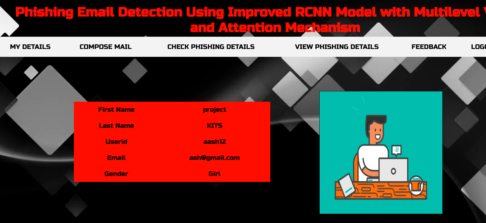
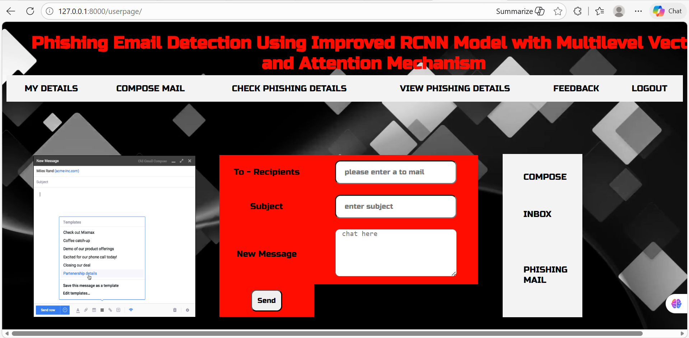
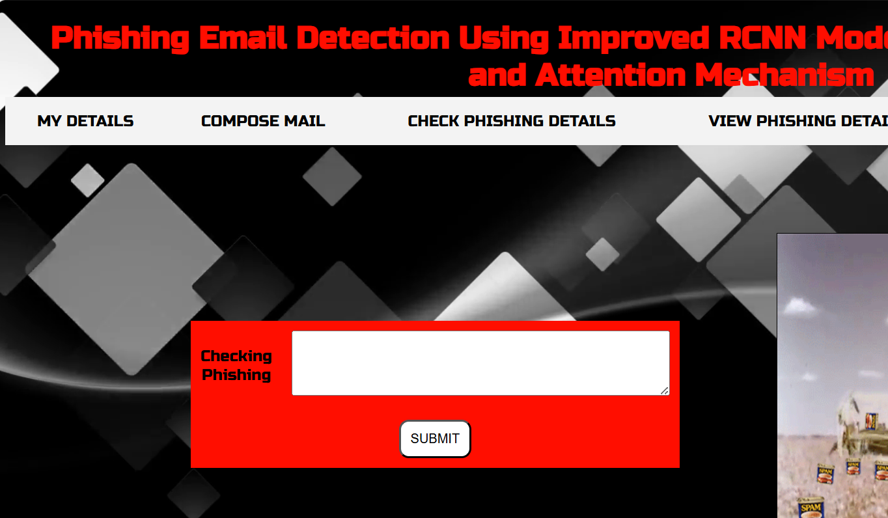

# Phishing-Email-Detection-Using-Improved-RCNN

## Overview
This project detects phishing emails using an Improved RCNN deep learning model. It helps identify malicious emails and classify them accurately.

## Features
- Detects phishing emails
- Email classification
- User-friendly web interface
- Secure login system

## Technologies Used
- Python
- Django
- HTML
- CSS
- JavaScript
- MySQL

## How to Run
1. Clone the repository.
2. Install the required dependencies.
3. Configure the MySQL database.
4. Run:
   ```
   python manage.py runserver
   ```
5. Open:
   ```
   http://127.0.0.1:8000
   ```
# Phishing-Email-Detection-Using-Improved-RCNN

## Overview
This project detects phishing emails using an Improved RCNN deep learning model. It helps identify malicious emails and classify them accurately.

## Features
- Detects phishing emails
- Email classification
- User-friendly web interface
- Secure login system

## Technologies Used
- Python
- Django
- HTML
- CSS
- JavaScript
- MySQL

## How to Run
1. Clone the repository.
2. Install the required dependencies.
3. Configure the MySQL database.
4. Run:
   ```
   python manage.py runserver
   ```
5. Open:
   ```
   http://127.0.0.1:8000
   ```

## Screenshots

### Registration Form


### Sign in Page


### My Details

## Author

### Compose Email


### Checking Phishing


### Inbox Message


### Phishing Result


### Feedback


## Author
Aashritha Maroju
